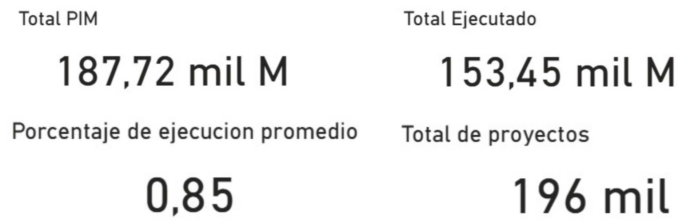
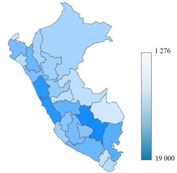
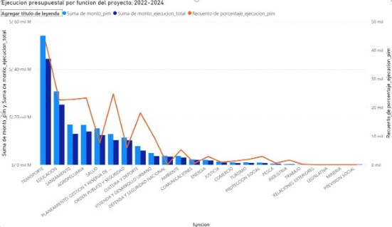
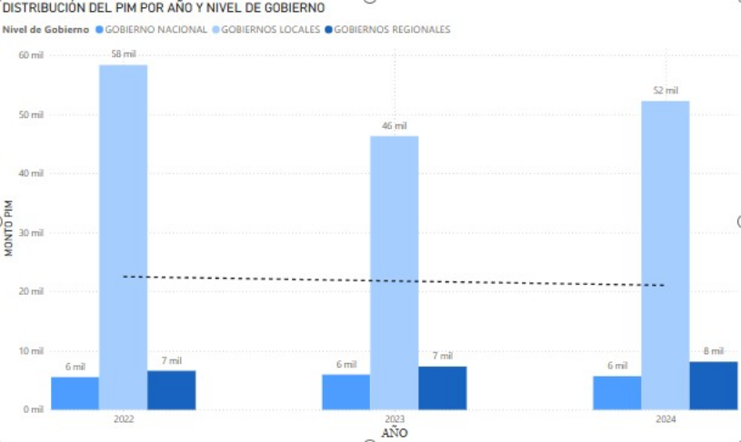

#  Análisis y Visualización de la Inversión Pública en el Perú

## Descripción del proyecto
Este proyecto tiene como objetivo analizar los datos de los proyectos de
inversión pública en el Perú, identificando patrones relevantes según
nivel de gobierno, función y distribución territorial. El análisis se
enfoca en transformar datos abiertos en información comprensible que
pueda apoyar iniciativas de visualización y análisis de datos sociales.

📄 [Informe técnico del proyecto](docs/Analisis_y_Visualizacion_de_la_Inversion_Publica_en_el_Perú.pdf)

##  Fuente de datos
Los datos utilizados provienen del portal de Datos Abiertos del
Ministerio de Economía y Finanzas (MEF), específicamente del conjunto
**“Seguimiento de Proyectos de Inversión”**.  
Se trabajó principalmente con el dataset correspondiente al año 2024,
por ser el último disponible de forma completa.

🔗 https://datosabiertos.mef.gob.pe/dataset/seguimiento-de-proyectos-de-inversion

## Herramientas utilizadas
- **Python** (pandas, plotly) para exploración y análisis inicial
- **SQL Server** para el modelado y organización de los datos
- **Power BI** para la visualización y construcción de dashboards
- **Google Colab** como entorno de trabajo

##  Metodología
1. Exploración y limpieza inicial de los datos utilizando Python.
2. Selección de variables relevantes y definición del nivel de análisis.
3. Modelado de los datos bajo un esquema de tipo estrella (Kimball).
4. Desarrollo de visualizaciones y dashboards en Power BI para comunicar
   los resultados de forma clara.

##  Modelado de datos (SQL Server)

Como parte del proyecto, se diseñó un modelo dimensional tipo
estrella (enfoque Kimball) utilizando SQL Server, con el objetivo de
facilitar el análisis de la inversión pública y su posterior
visualización en Power BI.

El modelo se estructura alrededor de una tabla de hechos de proyectos
de inversión, relacionada con dimensiones clave como función,
entidad ejecutora, ubicación, fuente de financiamiento y producto del
proyecto. Este enfoque permitió simplificar las consultas analíticas y
optimizar el diseño del dashboard.

##  Visualización de resultados
Los datos modelados fueron utilizados para construir dashboards
interactivos en Power BI, orientados a analizar la ejecución de la
inversión pública desde un enfoque territorial, funcional y de
eficiencia presupuestal.

### Distribución general de la ejecución presupuestal

Durante el período 2022–2024, el Presupuesto Institucional Modificado (PIM)
acumulado alcanzó aproximadamente S/ 187,7 mil millones, de los cuales se
ejecutaron S/ 153,4 mil millones, lo que representa una ejecución promedio
del 85 % a nivel nacional. En este período se registraron cerca de
196 mil proyectos de inversión

### Distribución territorial de la inversión (brecha planificación–ejecución)

El gráfico muestra las diferencias entre el presupuesto planeado y el
monto efectivamente ejecutado en cada departamento. Los tonos más
oscuros representan mayores brechas, lo que podría estar asociado a
problemas en la planificación presupuestal o en la ejecución de los
proyectos.

Destacan departamentos como Lima, Cusco y Arequipa, donde la diferencia
entre lo presupuestado y lo ejecutado es significativamente mayor,
sugiriendo la necesidad de un análisis más profundo sobre los factores
institucionales y operativos que influyen en estos resultados.

### Ejecución por función del proyecto

Las funciones de Transporte, Educación y Salud concentran la mayor parte
del presupuesto asignado a nivel nacional. No obstante, el porcentaje de
ejecución varía de manera significativa entre funciones, lo que sugiere
diferencias en la capacidad operativa y de gestión según el tipo de
intervención pública.

### Eficiencia por nivel de gobierno

Se observa un crecimiento sostenido tanto del presupuesto asignado como del monto ejecutado en los tres años analizados, reflejando un aumento en la inversión pública. No obstante, la eficiencia en la ejecución se ha mantenido relativamente constante.

> El dashboard completo incluye visualizaciones adicionales orientadas
al análisis de eficiencia presupuestal, evolución temporal y brechas
regionales, disponibles en la carpeta `/images/powerbi/`.

##  Conclusiones
El análisis permitió identificar patrones relevantes en la asignación de
la inversión pública, destacando la concentración de proyectos en
determinadas funciones y regiones. Este enfoque evidencia el potencial
de los datos abiertos para apoyar proyectos de transparencia,
visualización y análisis social.

## 👤 Autor
Michael Garnelo
