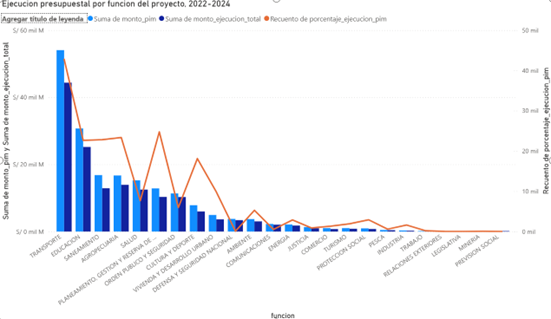

#  Análisis y Visualización de la Inversión Pública en el Perú

## Descripción del proyecto
Este proyecto tiene como objetivo analizar los datos de los proyectos de
inversión pública en el Perú, identificando patrones relevantes según
nivel de gobierno, función y distribución territorial. El análisis se
enfoca en transformar datos abiertos en información comprensible que
pueda apoyar iniciativas de visualización y análisis de datos sociales.

##  Fuente de datos
Los datos utilizados provienen del portal de Datos Abiertos del
Ministerio de Economía y Finanzas (MEF), específicamente del conjunto
**“Seguimiento de Proyectos de Inversión”**.  
Se trabajó principalmente con el dataset correspondiente al año 2024,
por ser el último disponible de forma completa.

🔗 https://datosabiertos.mef.gob.pe/dataset/seguimiento-de-proyectos-de-inversion

## Herramientas utilizadas
- **Python** (pandas, plotly) para exploración y análisis inicial
- **SQL Server** para el modelado y organización de los datos
- **Power BI** para la visualización y construcción de dashboards
- **Google Colab** como entorno de trabajo

##  Metodología
1. Exploración y limpieza inicial de los datos utilizando Python.
2. Selección de variables relevantes y definición del nivel de análisis.
3. Modelado de los datos bajo un esquema de tipo estrella (Kimball).
4. Desarrollo de visualizaciones y dashboards en Power BI para comunicar
   los resultados de forma clara.

##  Modelado de datos (SQL Server)

Como parte del proyecto, se diseñó un modelo dimensional tipo
estrella (enfoque Kimball) utilizando SQL Server, con el objetivo de
facilitar el análisis de la inversión pública y su posterior
visualización en Power BI.

El modelo se estructura alrededor de una tabla de hechos de proyectos
de inversión, relacionada con dimensiones clave como función,
entidad ejecutora, ubicación, fuente de financiamiento y producto del
proyecto. Este enfoque permitió simplificar las consultas analíticas y
optimizar el diseño del dashboard.

##  Visualización de resultados
Los datos modelados fueron utilizados para construir dashboards
interactivos en Power BI, orientados a analizar la ejecución de la
inversión pública desde un enfoque territorial, funcional y de
eficiencia presupuestal.

### Distribución general de la ejecución presupuestal

### Distribución territorial de la inversión

### Ejecución por función del proyecto

### Eficiencia por nivel de gobierno

##  Conclusiones
El análisis permitió identificar patrones relevantes en la asignación de
la inversión pública, destacando la concentración de proyectos en
determinadas funciones y regiones. Este enfoque evidencia el potencial
de los datos abiertos para apoyar proyectos de transparencia,
visualización y análisis social.

## 👤 Autor
Michael Garnelo
